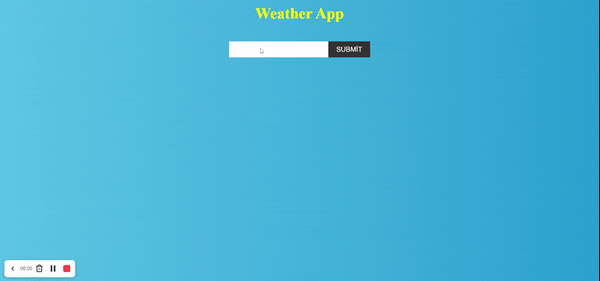

# Weather-App-API

## Welcome! 👋

Thanks to visit my Github! This project is created with HTML, CSS and JavaScript axios and fecth. Here is the link for this project (https://omer-yagci.github.io/Weather-App-API/
)

## Description

Project aims to display current weather data of searched city around the world with fetching Weather Api data.

## Learning Outcomes

At the end of the this project, I will be able to;

- analyze a problem, create a weather condition app populated with a real weather api.

- demonstrate their knowledge of algorithmic design principles.

## Problem Statement

- Design a weather condition page following the design and populate data for searched city with using of axios in JS.

User story; 

- User can search city around the world.
- The app can fetch api with the searched city name(... and apikey if it is obligatory).
- User can display weather data of searched city in weather card.
- User can display list of searched city weather data card like on gif.
- If new searched city is in the weather data list, app can display a warning text to user on page.

🔥 I used [OpenWeather Api](https://openweathermap.org/) for this app.

## Got feedback for me?

Feedbacks are always improve my technical knowledge, so feel free to give me a feedback through my LinkedIn account (https://www.linkedin.com/in/omer-kagan-yagci/) 🙌

**That Is What I Did!** 🚀
